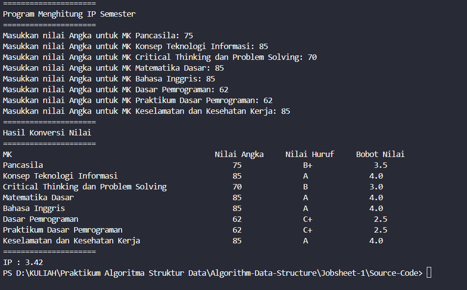
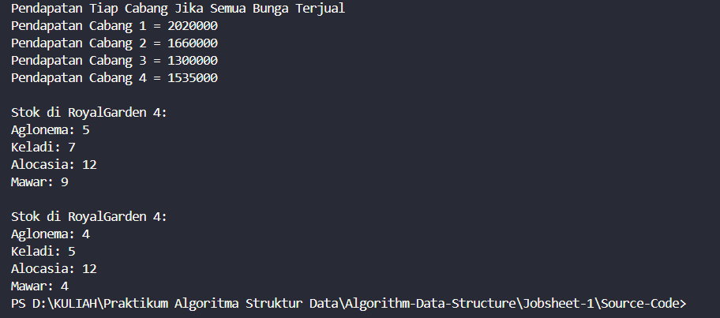
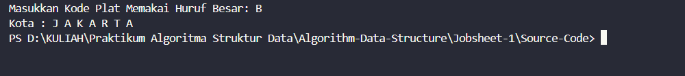
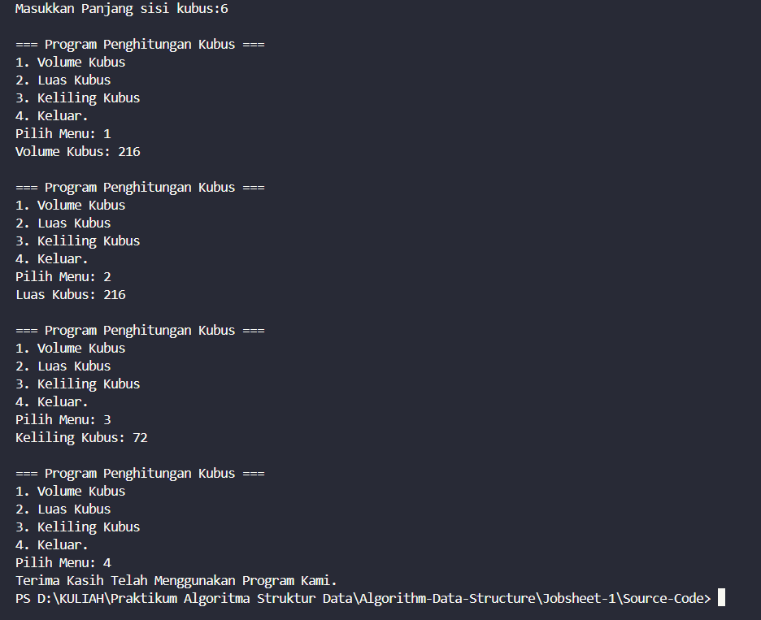

|  | Algorithm and Data Structure |
|--|--|
| NIM |  244107020027 |
| Nama |  Muhammad Rayhan Zamzami |
| Kelas | TI - 1H |
| Repository | [link] (https://github.com/mrayhanz/Algorithm-Data-Structure) |

# Labs #1 Programming Fundamentals Review

## 1. Pemilihan

Solusi dari implementasi Pemilihan1.java, dan menampilkan Screenshot hasil.

**Brief explanaton:** Ada 4 langkah utama:
1. Input Semua Nilai
2. Memvalidasi Semua Nilai yang sudah di input
3. Penjumlahan Dan Konvert Ke Nilai Huruf
4. Menampilkan Status Lulus

## 2. Perulangan

Solusi dari implementasi Perulangan.java, dan menampilkan Screenshot hasil.

**Brief explanaton:** Ada 4 langkah utama:
1. Input NIM
2. Mengambil 2 digit terakhir dari nim 
3. Buat kondisi ketika bilangan tersebut ganjil dan kondisi tertentu
4. Menampilkan Output

## 3. Array

Solusi dari implementasi Array.java, dan menampilkan Screenshot hasil.

**Brief explanaton:** Ada 5 langkah utama:
1. Membuat array untuk menyimpan nilai dan lainnya
2. Input nilai 0-100 
3. Menkonversi dari nilai angka ke huruf dan bobot nilai
4. Menampilkan Output
5. Menghitung IP serta menampilkannya

## 4. Fungsi

Solusi dari implementasi Fungsi.java, dan menampilkan Screenshot hasil.

**Brief explanaton:** Ada 3 langkah utama:
1. Membuat array static untuk stock serta harga
2. Membuat fungsi untuk menghitung serta menampilkan semua pendapatan,stok cabang ke 4 serta mengurangi stok cabang ke 4 dan menampilkan stok cabang ke 4 
3. Menampilkan Semuanya di output

## 5. Tugas 1

Solusi dari implementasi Tugas1.java, dan menampilkan Screenshot hasil.

**Brief explanaton:** Ada 4 langkah utama:
1. Membuat char array untuk menyimpan kode dan kota
2. Input Kode plat  
3. Membuat perulangan untuk mencari kode plat
4. Menampilkan Output

## 6. Tugas 2

Solusi dari implementasi Tugas2.java, dan menampilkan Screenshot hasil.

**Brief explanaton:** Ada 4 langkah utama:
1. Input panjang sisi kubus
2. Membuat menu
3. fungsi menggunakan parameter untuk menghitung volume,luas,keliling kubus
4. Menampilkan Output

## 7. Tugas 3

Solusi dari implementasi Tugas3.java, dan menampilkan Screenshot hasil.

.png)
.png)
.png)
.png)

**Brief explanaton:** Ada 5 langkah utama:
1. Input Jumlah Matkul
2. Membuat array untuk matkul,sks,semester,hari dengan panjang sesuai input jumlah matkul
3. membuat menu
4. Membuat fungsi untuk input jadwal,tampil seluruh jadwal,mencari jadwal dari hari,semester serta mata kuliah
5. Menampilkan output
