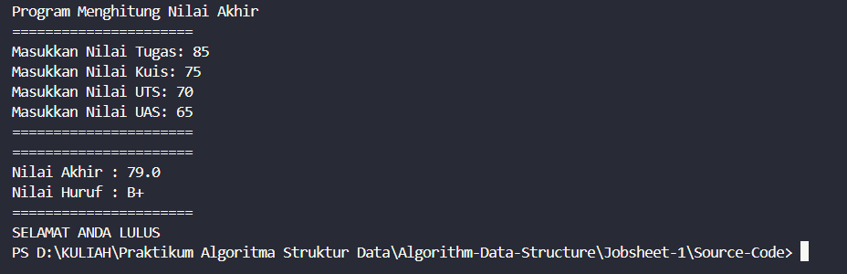
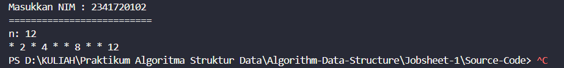

|  | Algorithm and Data Structure |
|--|--|
| NIM |  244107020027 |
| Nama |  Muhammad Rayhan Zamzami |
| Kelas | TI - 1H |
| Repository | [link] (https://github.com/mrayhanz/Algorithm-Data-Structure) |

# Labs #1 Programming Fundamentals Review

## 1 Pemilihan

Solusi dari implementasi Pemilihan1.java, dan menampilkan Screenshot hasil.

**Brief explanaton:** Ada 4 langkah utama:
1. Menginput Semua Nilai
2. Memvalidasi Semua Nilai yang sudah di input
3. Penjumlahan Dan Konvert Ke Nilai Huruf
4. Menampilkan Status Lulus

## 2 Perulangan

Solusi dari implementasi Perulangan.java, dan menampilkan Screenshot hasil.

**Brief explanaton:** Ada 4 langkah utama:
1. Menginput NIM
2. Mengambil 2 digit terakhir dari nim 
3. Buat kondisi ketika bilangan tersebut ganjil dan kondisi tertentu
4. Menampilkan Output
