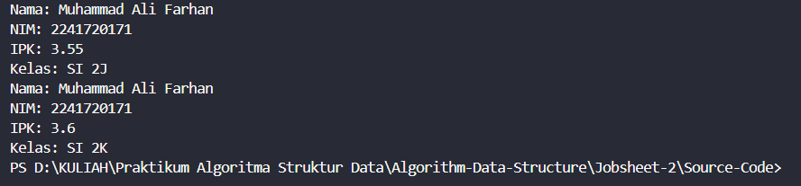
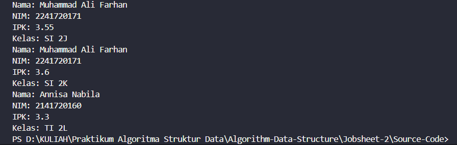

|  | Algorithm and Data Structure |
|--|--|
| NIM |  244107020027 |
| Nama |  Muhammad Rayhan Zamzami |
| Kelas | TI - 1H |
| Repository | [link] (https://github.com/mrayhanz/Algorithm-Data-Structure) |

# Labs #2 Object

## Percobaan 1

### 2.1.2 Verifikasi Hasil Percobaan 

 


### 2.1.3 Pertanyaan
1. Karakteristik class dan object :
   -memiliki method
   -memiliki property
2. Terdapat 4 Atribut : ```nama``` ```nim``` ```ipk``` ```kelas```
3. Terdapat 4 Method : ```tampilkanInformasi()``` ```ubahKelas()``` ```updateIPK()``` ```nilaiKerja()```
4. ```java
   void updateIPK(double ipkBaru){
    if (ipkBaru > 4.0 || ipkBaru < 0) {
       System.out.println("IPK harus antara 0-4.0");
    }else{
       ipk = ipkBaru;
    }
   }
   ```
5. Cara kerja method ```nilaiKinerja()``` adalah membandingkan value dari ```ipk``` yang di inputkan oleh user dan return String yang telah di tentukan.

## Percobaan 2

### 2.2.2 Verifikasi Hasil Percobaan

 


### 2.2.3 Pertanyaan
1. nama objek (```mhs1```)

   ```java
   Mahasiswa17 mhs1 = new Mahasiswa17();
   ```
2. menggunakan (.) setelah objek
3. karena telah di lakukan update ipk dan update kelas

## Percobaan 3

### 2.3.2 Verifikasi Hasil Percobaan




### 2.3.3 Pertanyaan
1. ```java
   Mahasiswa17(String nm, String nim, double ipk, String kls) {
      nama = nm;
      this.nim = nim;
      this.ipk = ipk;
      kelas = kls;
   }
   ```
2.
