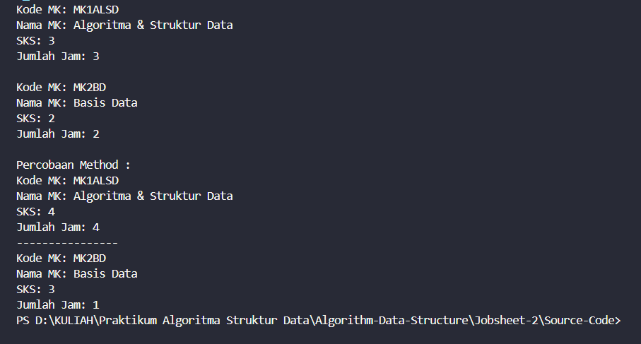
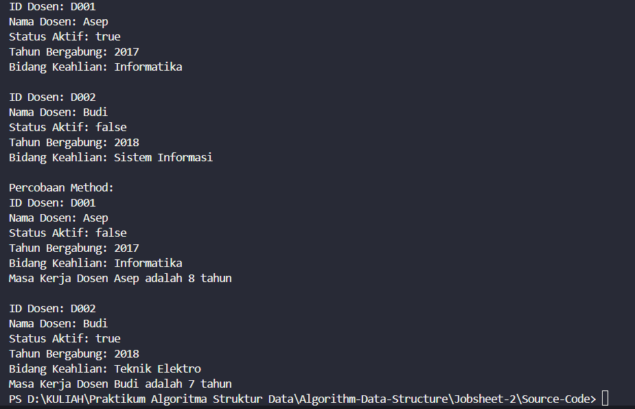

|  | Algorithm and Data Structure |
|--|--|
| NIM |  244107020027 |
| Nama |  Muhammad Rayhan Zamzami |
| Kelas | TI - 1H |
| Repository | [link] (https://github.com/mrayhanz/Algorithm-Data-Structure) |

# Labs #2 Object

## Percobaan 1

### 2.1.2 Verifikasi Hasil Percobaan 

 


### 2.1.3 Pertanyaan
1. Karakteristik class dan object :
   -memiliki method
   -memiliki property
2. Terdapat 4 Atribut : ```nama``` ```nim``` ```ipk``` ```kelas```
3. Terdapat 4 Method : ```tampilkanInformasi()``` ```ubahKelas()``` ```updateIPK()``` ```nilaiKerja()```
4. ```java
   void updateIPK(double ipkBaru){
    if (ipkBaru > 4.0 || ipkBaru < 0) {
       System.out.println("IPK harus antara 0-4.0");
    }else{
       ipk = ipkBaru;
    }
   }
   ```
5. Cara kerja method ```nilaiKinerja()``` adalah membandingkan value dari ```ipk``` yang di inputkan oleh user dan return String yang telah di tentukan.

## Percobaan 2

### 2.2.2 Verifikasi Hasil Percobaan

 


### 2.2.3 Pertanyaan
1. nama objek (```mhs1```)

   ```java
   Mahasiswa17 mhs1 = new Mahasiswa17();
   ```
2. menggunakan (.) setelah objek
3. karena telah di lakukan update ipk dan update kelas

## Percobaan 3

### 2.3.2 Verifikasi Hasil Percobaan


### 2.3.3 Pertanyaan
1. ```java
   Mahasiswa17(String nm, String nim, double ipk, String kls) {
      nama = nm;
      this.nim = nim;
      this.ipk = ipk;
      kelas = kls;
   }
   ```
2. Melakukan intansiasi dengan konstruktor dan mendeklarasikan atribut
3. Terjadi error,karena jika konstruktor default di hapus maka konstruktor berparameter otomatis menjadi konstruktor default,sehingga saat instansiasi objek harus mengisi parameter
4. Tidak, karena method di class ```Mahasiswa``` dapat diakses secara acak atau berurutan,karena tidak membutuhkan data dari method lain untuk berjalan
5.
   ``` java
    Mahasiswa17 mhs3 = new Mahasiswa17("Muhammad Rayhan" ,"244107020027",3.80,"TI 1H");
    mhs3.updateIPK(4.00);
    mhs3.tampilkanInformasi();
   ```
## Latihan Praktikum

### 1 . Class MataKuliah



Penjelasan Kode :

1.Mendeklerasikan Variabel untuk menyimpan data, ```MataKuliah17``` ber atribut ```KodeMK``` ```nama``` yang bertipe data ```String``` dan ```sks``` ```jumlahJam``` berupa tipe data ```int```.
2.Menginisialisasi objek, ```mk1``` dibuat menggunakan konstruktor default sedangkan ```mk2``` menggunakan konstruktor berparameter
3.Menampilkan output menggunakan metode ```tampilInformasi()```
4.Mengubah data mata kuliah menggunakan metode ```ubahSKS(int sksBaru)``` ```tambahJam(int jam)``` ```kurangiJam(int jam)```,metode tersebut memungkinkan untuk mengubah data mata kuliah
5.Menampilkan output kembali karena ada data yang di ubah

### 2. Class Dosen



Penjelasan Kode :

