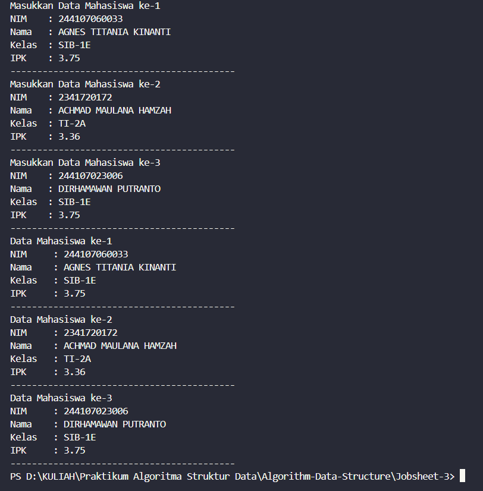
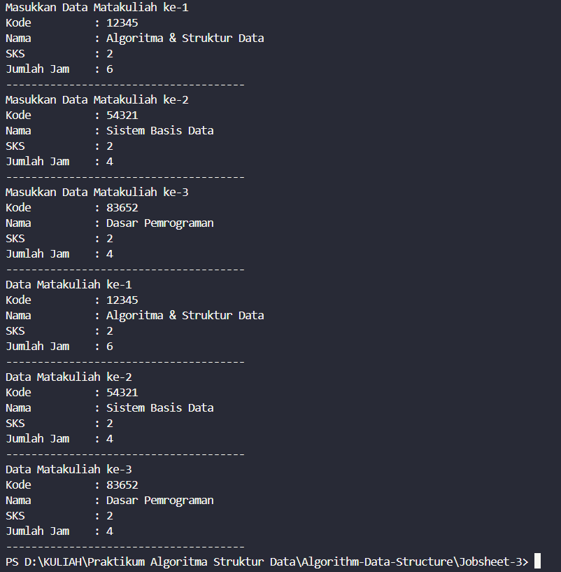
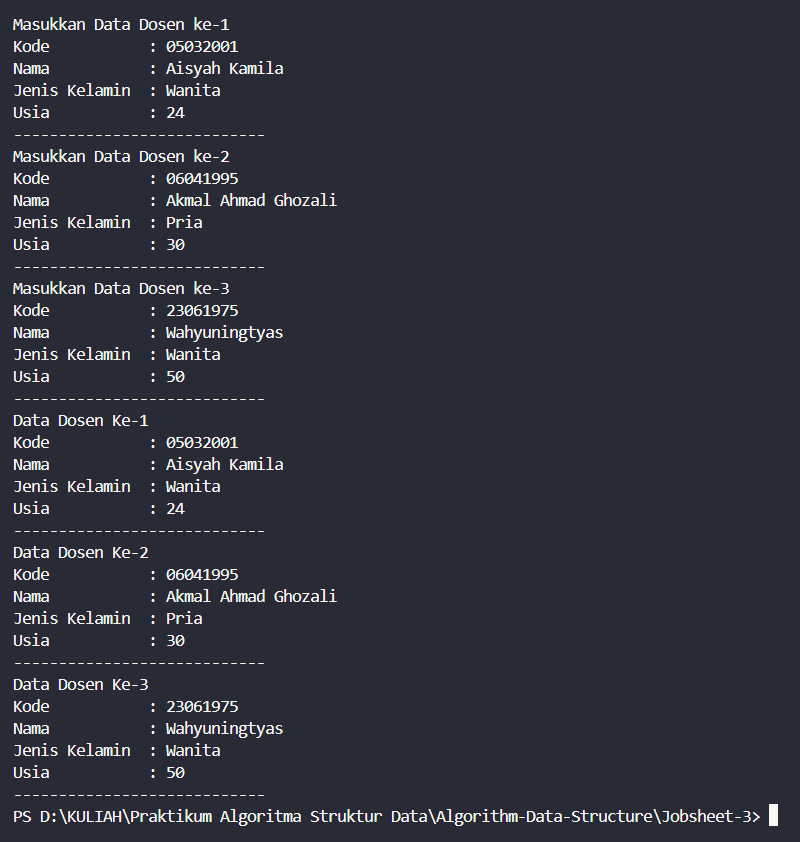
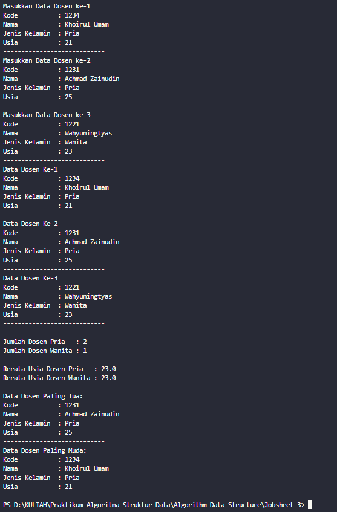

|  | Algorithm and Data Structure |
|--|--|
| NIM |  244107020027 |
| Nama |  Muhammad Rayhan Zamzami |
| Kelas | TI - 1H |
| Repository | [link] (https://github.com/mrayhanz/Algorithm-Data-Structure) |

# Labs #3 Array Of Object

## Percobaan 1

### 3.2.2 Verifikasi Hasil Percobaan 

 


### 3.2.3 Pertanyaan
1. Tidak, karena class pada array of object tidak selalu harus memiliki atribut dan method sekaligus,bisa jadi class dengan atribut saja jika class hanya untuk menyimpan data,maka cukup memiliki atribut tanpa method.
2. Melakukan inisialisasi array dengan tipe data sebuah class, dengan jumlah elemen 3.
3. class ```Mahasiswa17``` tidak memiliki kontruktor,tetapi secara default jika kita membuat class tanpa konstruktor maka otomatis akan membuat konstruktor default tanpa parameter sehingga objek tetap dapat di instansiasi.
4. Kode tersebut mengisi nilai pada seluruh atribut yang ada di dalam object array yang berindex 0.
5. Dipisahkan Karena class ```MahasiswaDemo17```berisi method main dan pada ```java``` method main harus dalam sebuah public class dengan memiliki nama yang sama dengan nama file.

## Percobaan 2

### 3.3.2 Verifikasi Hasil Percobaan 

 


### 3.3.3 Pertanyaan
1. Tambahkan method ```cetakinfo()```
``` java
    void cetakinfo(){
        System.out.println("NIM     : " + nim);
        System.out.println("Nama    : " + nama);
        System.out.println("Kelas   : " + kelas);
        System.out.println("IPK     : " + ipk);
    }
```
``` java
        for (int i = 0; i < 3; i++) {
            System.out.println("Data Mahasiswa ke-" + (i+1));
            arrayOfMahasiswa[i].cetakinfo();
            System.out.println("------------------------------------------");
        }
```
2. Karena objek pada index 0 belum di instansiasi.


## Percobaan 3

### 3.4.2 Verifikasi Hasil Percobaan 

 


### 3.4.3 Pertanyaan
1.Bisa,asalkan setiap konstruktor memiliki parameter yang berbeda contohnya :
```java
    public Mahasiswa() {
        this.nama = "Tidak diketahui";
        this.umur = 0;
    }

    // Constructor kedua 
    public Mahasiswa(String nama) {
        this.nama = nama;
        this.umur = 0;
    }

    // Constructor ketiga
    public Mahasiswa(String nama, int umur) {
        this.nama = nama;
        this.umur = umur;
    }
```
2. Tambahkan method ```tambahData()```
```java
    void tambahData(){
        Scanner sc = new Scanner(System.in);

        System.out.print("Kode          : ");
        this.kode = sc.nextLine();
        System.out.print("Nama          : ");
        this.nama = sc.nextLine();
        System.out.print("SKS           : ");
        this.sks = sc.nextInt();
        System.out.print("Jumlah Jam    : ");
        this.jumlahJam = sc.nextInt();
        
        System.out.println("--------------------------------------");
    }
```

```java
        for (int i = 0; i < 3; i++) {
            System.out.println("Masukkan Data Matakuliah ke-" + (i+1));
            arrayOfMatakuliah[i] = new Matakuliah17();
            arrayOfMatakuliah[i].tambahData();
        }
```
3. Tambahkan method ```cetakinfo()```
```java
    void cetakinfo(){
        System.out.println("Kode          : " + this.kode);
        System.out.println("Nama          : " + this.nama);
        System.out.println("SKS           : " + this.sks);
        System.out.println("Jumlah Jam    : " + this.jumlahJam);
        System.out.println("--------------------------------------");
    }
```
```java 
    for (int i = 0; i < 3; i++){
        System.out.println("Data Matakuliah ke-" + (i+1));
        arrayOfMatakuliah[i].cetakinfo();
    }
```
4. Modifikasi panjang elemen array agar bisa di tentukan oleh user
```java
    System.out.print("Masukkan Jumlah Matakuliah : ");
    int matkul = sc.nextInt();
    Matakuliah17[] arrayOfMatakuliah = new Matakuliah17[matkul];
```

## Tugas 

### Tugas 1

 

 ### Penjelasan Singkat

 **1. Deklarasi Variabel dalam Dosen17**
 Mendeklarasikan Variabel untuk menyimpan data dosen yang akan di inputkan oleh pengguna
- kode (String) → Menyimpan kode dosen.
- nama (String) → Menyimpan nama dosen.
- jenisKelamin (boolean) → true untuk pria, false untuk wanita.
- usia (int) → Menyimpan usia dosen.

**2. Membuat Konstruktor untuk Inisialisasi**
- Konstruktor tanpa parameter Dosen17() dibuat untuk memungkinkan pembuatan objek tanpa langsung mengisi data.
- Konstruktor dengan parameter Dosen17(String kode, String nama, boolean jenisKelamin, int usia) memungkinkan inisialisasi langsung saat objek dibuat dengan data yang diberikan.

**3.Menambahkan Data Dosen Melalui Method ```tambahData()```**
- Program meminta pengguna untuk memasukkan kode, nama, jenis kelamin, dan usia.
- Input jenis kelamin divalidasi agar hanya menerima "Pria" atau "Wanita".
- Jika pengguna memasukkan "Pria", maka jenisKelamin diset sebagai true, sedangkan jika "Wanita", maka jenisKelamin diset sebagai false.

**4.Cetak Informasi Melalui Method ```cetakinfo()```**
- Semua data yang telah dimasukkan akan ditampilkan ke layar.
- Nilai boolean pada jenisKelamin dikonversi ke dalam bentuk string, "Pria" untuk true dan "Wanita" untuk false.

## Tugas 2

 

 ### Penjelasan Singkat