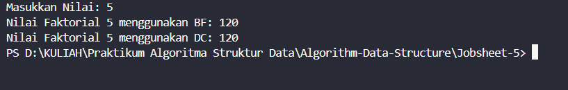
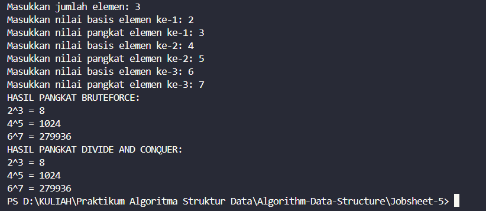
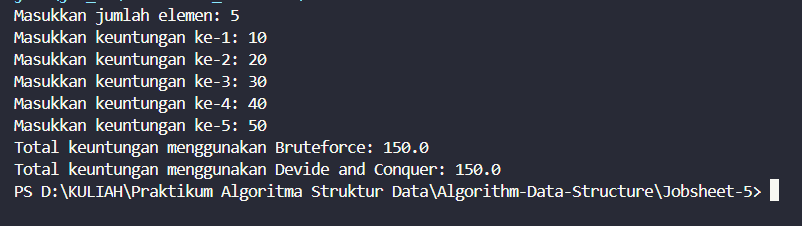
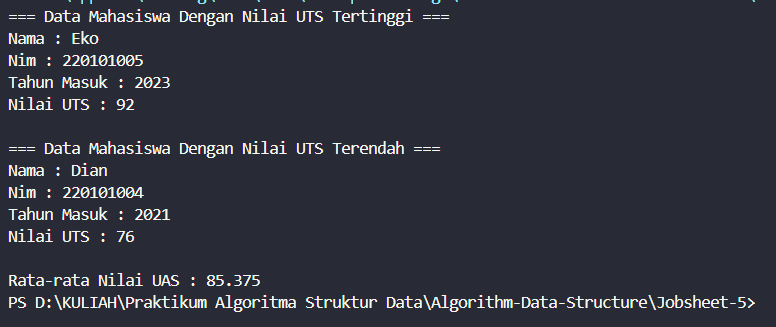

|  | Algorithm and Data Structure |
|--|--|
| NIM |  244107020027 |
| Nama |  Muhammad Rayhan Zamzami |
| Kelas | TI - 1H |
| Repository | [link] (https://github.com/mrayhanz/Algorithm-Data-Structure) |

# Labs #5 BRUTE FORCE & DIVIDE CONQUER

## Percobaan 1

### 5.2.2 Verifikasi Hasil Percobaan 

 


### 5.2.3 Pertanyaan
1.  ```if (n == 1)``` adalah base case yang mengembalikan nilai 1, agar rekursi berhenti, ```else``` Melakukan pemanggilan rekursif dengan mengalikan n dengan hasil faktorial dari ```( n -1 )```, yaitu
    ```java
    int fakto = n * faktorialDC(n-1);
        return fakto;
    ```
2.  Ya, perulangan dalam ```faktorialBF()``` bisa diubah dengan while loop tanpa mengubah logika dasarnya.
    ```java
    int faktorialBF(int n){
    int fakto = 1
    int i = 1;
        while (i <= n) {
            fakto *= i;
            i ++;
        }
        return fakto;
    }
    ```

3. Perbedaan :
- ```fakto *= i;``` Digunakan dalam iterasi, memperbarui nilai fakto setiap loop.
- ```int fakto = n * faktorialDC(n-1);``` Digunakan dalam rekursi, menyimpan hasil perkalian n dengan hasil pemanggilan fungsi faktorial untuk n-1.

4. Kesimpulan Perbedaan : 
- ```faktorialBF()``` Menggunakan perulangan (iterasi), lebih efisien dalam penggunaan memori karena tidak menyimpan banyak call stack.
- ```faktorialDC()``` Menggunakan rekursi, lebih elegan dalam penulisan tetapi bisa menyebabkan stack overflow untuk nilai n yang besar.

### 5.3.2 Verifikasi Hasil Percobaan 

 


### 5.3.3 Pertanyaan

1. Perbedaan 2 Method : 
- ```pangkatBF()``` (Brute Force) menghitung pangkat dengan cara mengalikan angka secara berulang dalam perulangan for.
- ```pangkatDC()``` (Divide and Conquer) menghitung pangkat dengan membagi masalah menjadi lebih kecil, lalu mengkombinasikan hasilnya menggunakan rekursi untuk efisiensi yang lebih baik.

2.Tahap combine sudah ada di dalam ```pangkatDC()```, dan ditunjukkan pada bagian : 
```java
    if (n%2==1) {
        return (pangkatDC(a, n/2) * pangkatDC(a, n/2) * a);
    } else {
        return (pangkatDC(a, n/2) * pangkatDC(a, n/2));
    }
```

3. Karena class Pangkat sudah menyimpan atribut nilai dan pangkat, metode ini bisa dibuat tanpa parameter. Dan metode tanpa parameter akan mengambil nilai dari atribut class itu sendiri pada :
```java
    int pangkatBF(int a, int n) {
        int hasil = 1;
        for (int i =0; i < n; i++) {
            hasil = hasil * a;
        }
        return hasil;
    }
```

4. ```pangkatBF()``` bekerja dengan iterasi (perulangan for), kurang efisien untuk nilai pangkat yang besar. Sedangkan ```pangkatDC()``` membagi masalah, menyelesaikan bagian kecilnya, lalu menggabungkan hasilnya. Ini lebih cepat karena mengurangi jumlah operasi perkalian dengan membagi pangkat menjadi dua.

### 5.4.2 Verifikasi Hasil Percobaan 

 


### 5.4.3 Pertanyaan
1. Variabel mid digunakan untuk membagi array menjadi dua bagian, yaitu bagian kiri dan bagian kanan, dalam pendekatan Divide and Conquer. Hal ini memungkinkan metode ```totalDC()``` untuk menghitung total secara rekursif.

2. Statement ini digunakan untuk memecah masalah menjadi dua submasalah, yaitu menghitung total nilai dari separuh pertama ```lsum``` dan separuh kedua ```rsum``` dari array. 

3. Karena metode ```totalDC()``` membagi masalah menjadi dua submasalah, hasil dari kedua bagian harus dijumlahkan untuk mendapatkan total keseluruhan elemen dalam array.

4. Base case terjadi ketika hanya ada satu elemen yang tersisa dalam subarray, yaitu pada ```totalDC()```

5.  ```totalDC()``` bekerja dengan cara membagi array menjadi dua bagian hingga mencapai kondisi base case (satu elemen). Kemudian, hasil dari masing-masing bagian dikombinasikan dengan cara menjumlahkan hasil total dari bagian kiri dan kanan. Pendekatan ini dikenal sebagai Divide and Conquer, yang membuat perhitungan lebih efisien dibandingkan metode iteratif pada kasus besar.

## Latihan Praktikum

 

### Penjelasan 

1. Mendeklarasikan variabel untuk menyimpan data mahasiswa:
Kelas ```Tugas``` memiliki atribut seperti ```nama```, ```nim```, ```ThnMasuk```, ```nilaiUTS```, dan ```nilaiUAS```, yang digunakan untuk menyimpan informasi mahasiswa. Selain itu, terdapat array ```mhs[]``` yang nantinya akan digunakan untuk menyimpan kumpulan objek mahasiswa.

2. Menginisialisasi objek mahasiswa:
Di dalam kelas ```TugasMain```, dibuat array ```mhs[]``` dengan 8 elemen, masing-masing merepresentasikan objek mahasiswa dengan atribut yang telah ditentukan. Objek ini dibuat dengan menggunakan constructor berparameter.

3. Mencari nilai UTS tertinggi menggunakan Divide and Conquer:
Metode ```maxUtsDc()``` digunakan untuk mencari indeks mahasiswa dengan nilai UTS tertinggi menggunakan teknik Divide and Conquer.

- Jika hanya ada satu mahasiswa, maka indeks tersebut dikembalikan.

- Jika lebih dari satu, maka data dibagi menjadi dua bagian secara rekursif.

- Setelah menemukan nilai maksimum dari kedua bagian, dilakukan perbandingan untuk menentukan nilai UTS tertinggi.

- Hasilnya kemudian ditampilkan di ```TugasMain```.

4. Mencari nilai UTS terendah menggunakan Divide and Conquer:
Metode ```minUtsDc()``` bekerja dengan cara yang sama seperti ```maxUtsDc()```, tetapi untuk mencari nilai UTS terendah. Data mahasiswa dengan nilai UTS terendah juga ditampilkan di TugasMain.

5. Menghitung rata-rata nilai UAS :
Metode ```rataUas()``` menghitung rata-rata nilai UAS seluruh mahasiswa dengan menjumlahkan semua nilai UAS dalam array ```mhs```[], lalu membaginya dengan jumlah mahasiswa. Hasilnya ditampilkan dalam ```TugasMain```.