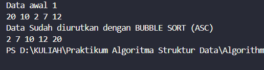
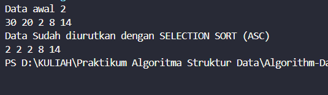
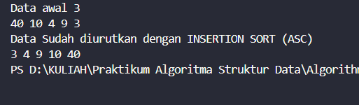
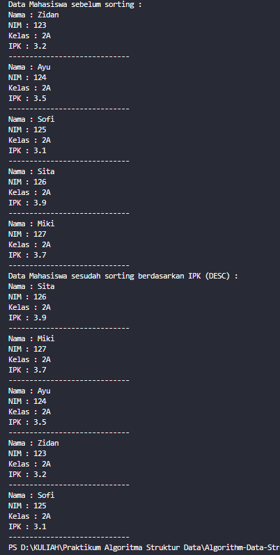
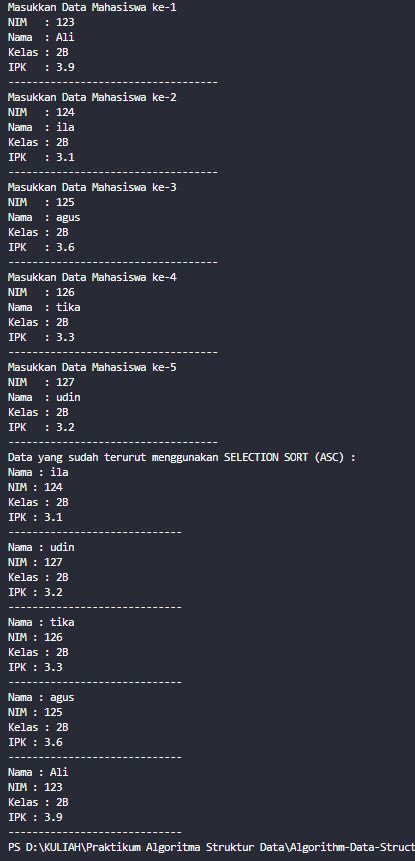
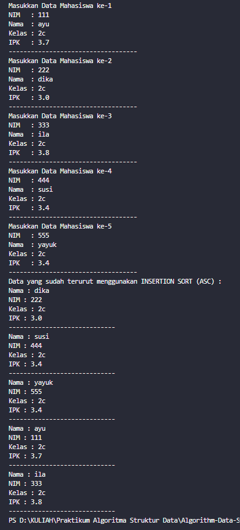
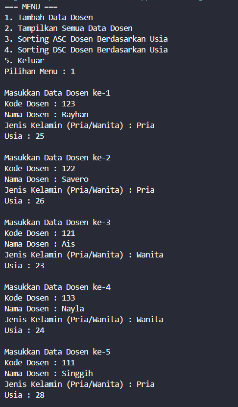
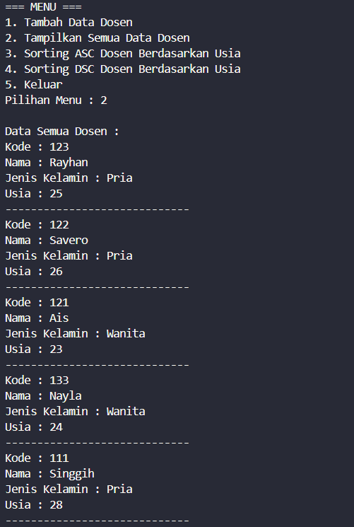
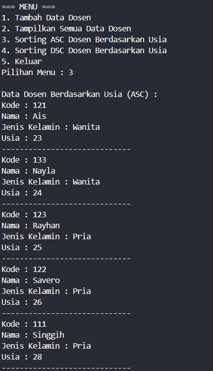
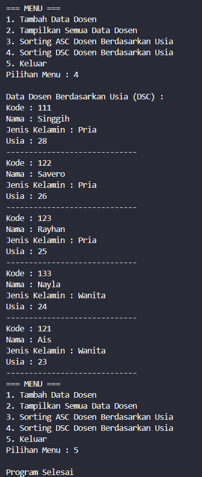

|  | Algorithm and Data Structure |
|--|--|
| NIM |  244107020027 |
| Nama |  Muhammad Rayhan Zamzami |
| Kelas | TI - 1H |
| Repository | [link] (https://github.com/mrayhanz/Algorithm-Data-Structure) |

# Labs #6  SORTING

## Percobaan 1

### 5.2.2 Verifikasi Hasil Percobaan

 


### 5.2.3 Verifikasi Hasil Percobaan

 


### 5.2.4 Verifikasi Hasil Percobaan

 

### 5.2.5 Pertanyaan
1. Kode ini adalah pertukaran (swap) dua elemen dalam array jika elemen sebelumnya (data[j-1]) lebih besar dari elemen saat ini (data[j]). 
- Jika kondisi data[j-1] > data[j] terpenuhi, maka kedua elemen bertukar posisi. 
- Ini adalah langkah dasar dalam Bubble Sort, di mana elemen yang lebih besar "menggelembung" ke kanan dalam array.

2. Kode Program algoritma pencarian nilai minim
```java
    int min = i;
    for (int j = i+1; j < jumData; j++) {
        if (data[j] < data[min]) {
        min = j;
        }
    }
```

3. Kondisi while (j >= 0 && data[j] > temp) digunakan dalam Insertion Sort untuk menggeser elemen ke kanan agar ada tempat bagi elemen yang sedang disisipkan (temp): 
- j >= 0 → memastikan indeks tidak keluar dari batas array. 
- data[j] > temp → jika elemen data[j] lebih besar dari temp, maka elemen tersebut harus digeser ke kanan untuk memberi ruang bagi elemen yang lebih kecil (temp). 

4. Tujuan dari perintah ini adalah menggeser elemen ke kanan untuk membuat tempat bagi elemen yang sedang disisipkan (temp). 
- Ketika elemen yang lebih besar ditemukan (data[j] > temp), maka elemen tersebut dipindahkan ke indeks j+1. 
- Proses ini berlanjut hingga ditemukan posisi yang tepat untuk menyisipkan temp. 

## Percobaan 2

### 5.3.2 Verifikasi Hasil Percobaan

 

### 5.3.3 Pertanyaan

1. Perhatikan Kode Program

    a. Karena pada bubble sort, setiap iterasi luar (i) memastikan bahwa elemen terbesar (atau terkecil dalam kasus sorting ascending) akan "mengambang" ke posisi yang benar.

    b. Setiap iterasi i memastikan bahwa satu elemen terbesar sudah berada di posisi akhir array. Oleh karena itu, tidak perlu memeriksa elemen yang sudah tersortir di belakang. Dengan mengurangkan i, kita menghindari pemeriksaan yang tidak perlu dan mengurangi kompleksitas.

    c. Perulangan i berlangsung sebanyak 50 - 1 = 49 kali.Pada setiap tahap iterasi tersebut, bubble sort memastikan bahwa satu elemen terbesar yang tersisa bergerak ke posisi akhirnya, sehingga setelah 49 tahap, semua elemen sudah terurut dengan benar. Jadi, jumlah tahap bubble sort sama dengan jumlah iterasi loop luar, yaitu 49 kali.

2. Modifikasi Kode Program
```java
        Scanner sc = new Scanner(System.in);

        for (int i = 0; i < 5; i ++){
            System.out.println("Masukkan Data Mahasiswa ke-" + (i + 1));
            System.out.print("NIM   : ");
            String nim = sc.nextLine();
            System.out.print("Nama  : ");
            String nama = sc.nextLine();
            System.out.print("Kelas : ");
            String kelas = sc.nextLine();
            System.out.print("IPK   : ");
            String ip = sc.nextLine();
            Double ipk = Double.parseDouble(ip);
            System.out.println("-----------------------------------");
            list.tambah(new Mahasiswa17(nim, nama, kelas, ipk));
        }
```

## Percobaan 3

### 5.3.6 Verifikasi Hasil Percobaan

 

### 5.3.7 Pertanyaan
1. Di dalam method selection sort
 - idxMin = i; 

    Menetapkan indeks elemen pertama dari iterasi saat ini sebagai indeks minimum sementara. 
 - for (int j = i + 1; j < listMhs.length; j++) 

    Melakukan pencarian elemen dengan nilai IPK terkecil dari sisa elemen setelah indeks i. 
  - if (listMhs[j].ipk < listMhs[idxMin].ipk) 
  
    Jika ditemukan elemen dengan IPK lebih kecil, maka indeks idxMin diperbarui ke indeks j. 
  - Hasilnya: 

    Setelah perulangan j selesai, idxMin akan berisi indeks elemen dengan IPK terkecil dalam sisa daftar. 
  
    Langkah selanjutnya adalah menukar elemen dengan indeks i dengan elemen di idxMin, sehingga elemen terkecil berpindah ke posisi yang benar.

Singkatnya, proses ini menentukan elemen terkecil dalam setiap iterasi sebelum dilakukan pertukaran, sehingga sorting bisa dilakukan dengan benar.

## Percobaan 4

### 5.4.2 Verifikasi Hasil Percobaan

 

### 5.4.3 Pertanyaan 

1. Ubah fungsi pada InsertionSort
```java
    void insertionSort(){
        for(int i = 1; i < listMhs.length; i++){
            Mahasiswa17 temp = listMhs[i];
            int j = i - 1;
            while (j >= 0 && listMhs[j-1].ipk < temp.ipk) {
                listMhs [j + 1 ] = listMhs [j];
                j = j -1;
            }
            listMhs[j + 1] = temp;
        }
    }
```


## Latihan Praktikum

 
 
 
 

### Penjelasan Singkat

**1. Mendeklarasikan variabel untuk menyimpan data dosen**

Kelas Dosen17 memiliki atribut kode, nama, jenisKelamin, dan usia, yang digunakan untuk menyimpan informasi dasar mengenai seorang dosen. Atribut-atribut ini diisi melalui konstruktor berparameter, dan ditampilkan lewat metode tampil().

**2. Menyimpan kumpulan objek dosen**

Kelas DataDosen17 memiliki array DataDosen17[] berisi objek Dosen17 yang dapat menampung hingga 5 dosen. Penambahan data dilakukan melalui metode tambah(), sedangkan seluruh data dapat ditampilkan menggunakan metode tampil().

**3. Menyortir data berdasarkan usia dosen**

Terdapat tiga metode sorting yang digunakan untuk mengurutkan dosen berdasarkan usia:
- SortingASC(): Mengurutkan usia dosen dari yang termuda ke yang tertua menggunakan bubble sort.
- SortingDSC(): Mengurutkan usia dosen dari yang tertua ke yang termuda menggunakan selection sort.
- insertionSort(): Menyediakan alternatif pengurutan menggunakan insertion sort (meskipun tidak digunakan dalam main, tetap tersedia).

**4. Interaksi pengguna melalui menu** 

Kelas DosenMain17 merupakan program utama yang memungkinkan pengguna untuk:
- Menambahkan data 5 dosen secara manual melalui input keyboard.
- Menampilkan semua data dosen.
- Melakukan pengurutan data dosen berdasarkan usia (naik dan turun).
- Mengakhiri program.
Menu dijalankan secara interaktif menggunakan Scanner, dan input untuk jenis kelamin diubah ke tipe boolean (true untuk "Pria", false untuk "Wanita") demi efisiensi penyimpanan data.