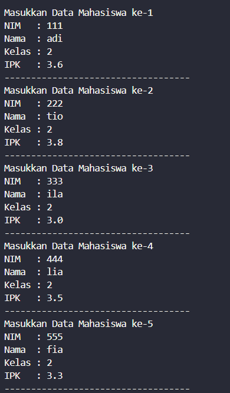
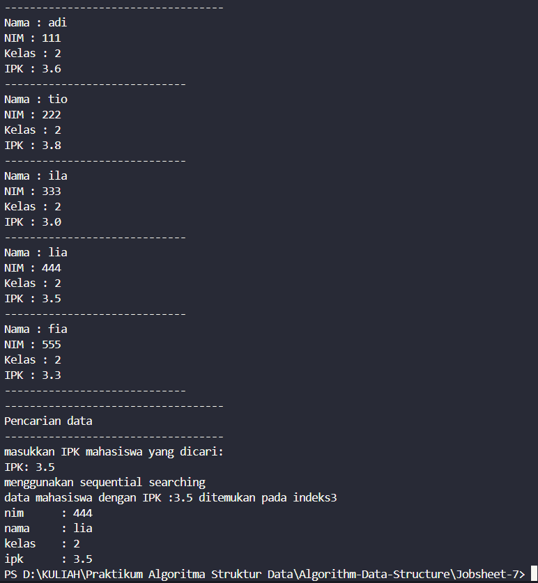
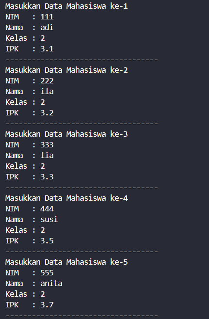
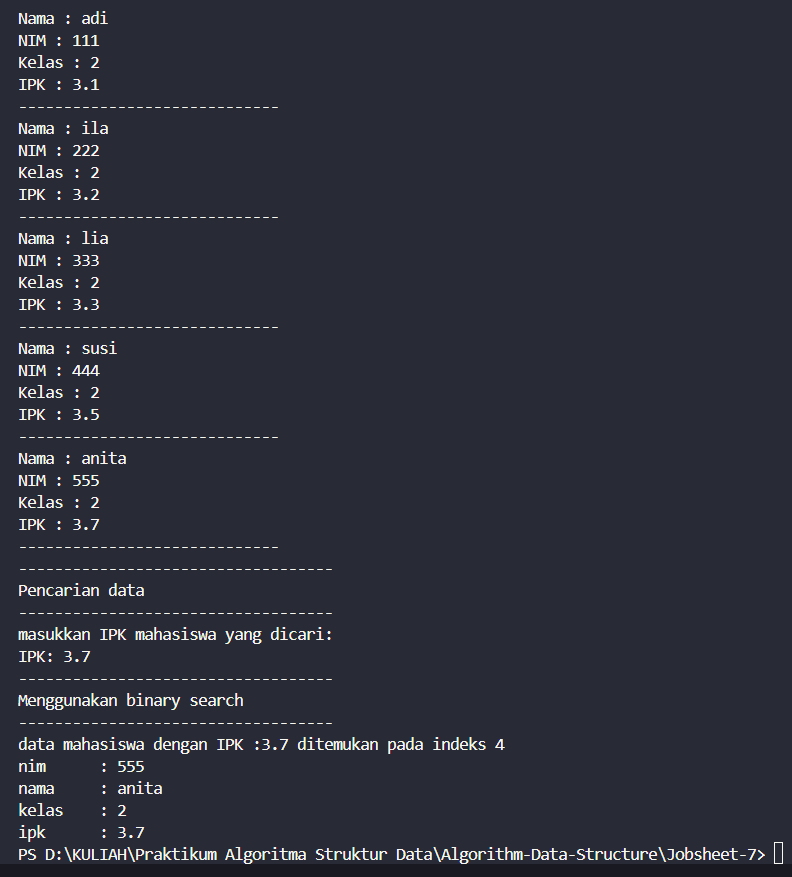
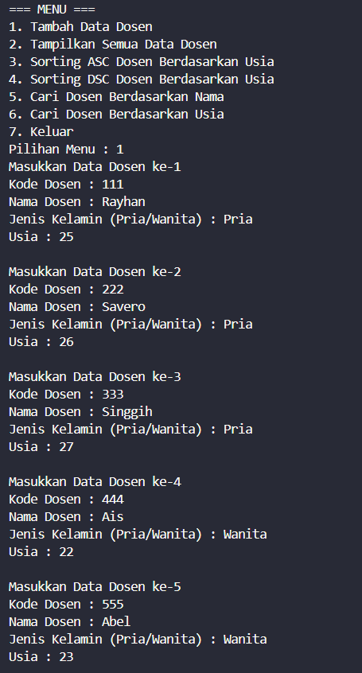
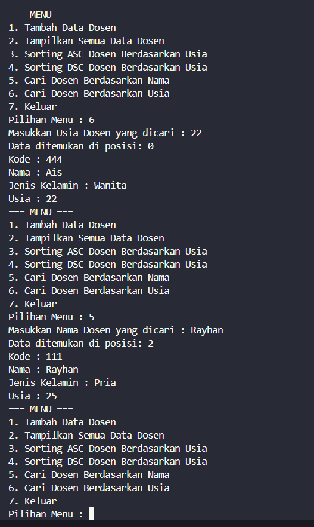

|  | Algorithm and Data Structure |
|--|--|
| NIM |  244107020027 |
| Nama |  Muhammad Rayhan Zamzami |
| Kelas | TI - 1H |
| Repository | [link] (https://github.com/mrayhanz/Algorithm-Data-Structure) |

# Labs #7  SEARCHING

## Percobaan 1

### 6.2.2 Verifikasi Hasil Percobaan
 
  

  


### 6.2.3 Pertanyaan

1. ```tampilDataSearch()``` berfungsi untuk menampilkan data mahasiswa yang di temukan, sedangkan ```tampilPosisi()``` berfungsi untuk menampilkan indeks posisi mahasiswa dalam array atau struktur data.

2. Fungsi break dalam kode tersebut :
- Menghentikan pencarian lebih awal: Setelah menemukan mahasiswa dengan IPK yang sesuai, pencarian tidak perlu dilanjutkan. 
- Meningkatkan efisiensi: Tanpa break, program akan tetap mengecek elemenelemen berikutnya, meskipun data yang dicari sudah ditemukan. 

## Percobaan 2

### 6.3.2 Verifikasi Hasil Percobaan

  

  

### 6.3.3 Pertanyaan

1. 
```java
            mid = (left + right) / 2;
```
2. 
```java
            if (cari == listMhs[mid].ipk) {
                return (mid);
            } else if (listMhs[mid].ipk>cari) {
                return findBinarySearch(cari, left, mid-1);
            }else{
                return findBinarySearch(cari, mid+1, right);
            }
```

3. Jika data tidak diurutkan, maka Sequential Search masih bisa berjalan, karena pencarian dilakukan satu per satu,  Binary Search akan gagal, karena Binary Search hanya bisa berjalan dengan benar jika data sudah dalam urutan tertentu (ascending). 

4. Jika data dimasukkan dalam urutan descending (menurun) seperti 3.8, 3.7, 3.5, 3.4, 3.2, maka Binary Search tidak akan memberikan hasil yang benar. Masalahnya Binary Search diasumsikan berjalan pada data terurut secara ascending (kecil -> besar), sedangkan data yang diberikan dalam urutan descending (besar -> kecil).

Modifikasi Kode :
```java 
listMhs[mid].ipk < cari
```

## Latihan Praktikum

  

  

### Penjelasan Singkat

Program menyediakan dua metode pencarian data dosen: pencarian berdasarkan nama (sequential search) dan pencarian berdasarkan usia (binary search). Keduanya diimplementasikan dalam kelas DataDosen17, dan digunakan dalam menu 5 dan 6 pada DosenMain17.

a. Pencarian berdasarkan nama (Sequential Search)
Metode sequentialSearching(String cari) digunakan untuk mencari data dosen berdasarkan nama menggunakan pencarian linear (sequential search).
- Pencarian dilakukan dengan memeriksa satu per satu elemen dalam array DataDosen17[].
- Jika nama dosen yang dicari cocok, maka posisi indeks dosen tersebut dikembalikan.
- Selain itu, sistem akan menghitung jumlah data dengan nama yang sama, dan memberi peringatan jika ditemukan lebih dari satu hasil.

b. Pencarian berdasarkan usia (Binary Search)
Metode findBinarySearch(double cari, int left, int right) digunakan untuk mencari data dosen berdasarkan usia menggunakan pencarian biner (binary search).
- Sebelum melakukan pencarian, data dosen harus diurutkan terlebih dahulu secara ascending (naik) menggunakan metode SortingASC().
- Binary search akan mencari usia yang dicari dengan membandingkan nilai tengah dari array yang sudah terurut.
- Jika ditemukan, posisi dosen dikembalikan.
- Sama seperti pada pencarian nama, metode ini juga menghitung jumlah data dengan usia yang sama, dan memberi peringatan jika ada lebih dari satu data.